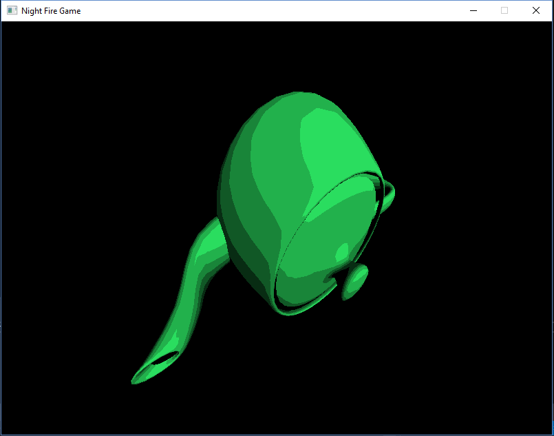
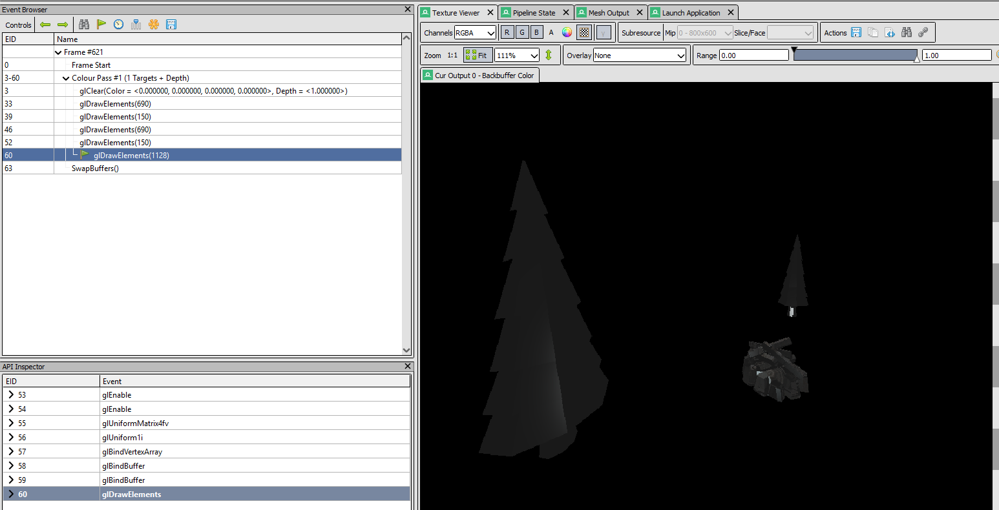
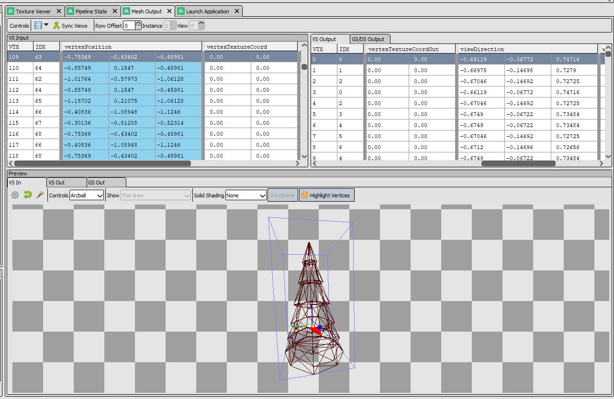
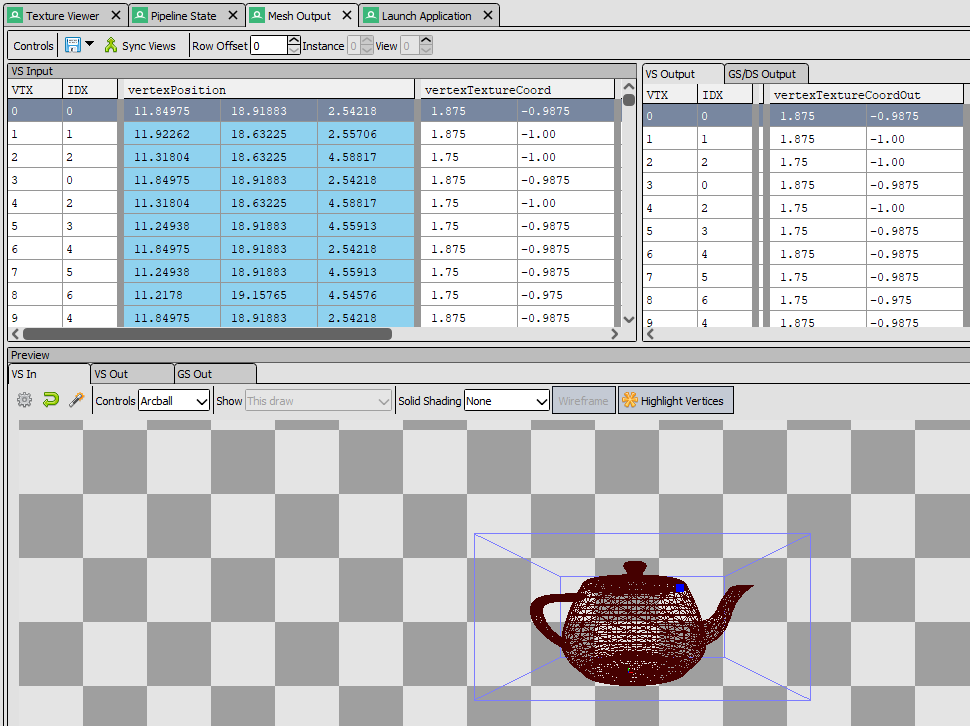

# comp220-worksheetA
## Prototype

### Point Light Effect
Lighting is an important part of my project, therefore I have been working on implementing a point light into the scene to act as the campfire light that will illuminate the surrounding trees.

### Cel Shading
I have also been experimenting with Cel Shading effects on a separate branch.

## Issues
I have had various issues with the prototype and so have been using RenderDoc to debug problems.
I was testing lighting and so wanted to give my tree mesh a texture just to make sure it was working but it appeared to not be working properly.

I used RenderDoc to try and determine what was at fault and while looking at the Mesh Output of the Tree I could see that it had no values for the vertex texture coordinates. 

If I want to include textures in the game I may have to find a different set of tree models that come with texture coordinates. 
I switched my Tree mesh with a Teapot mesh to make sure I was correct and the textures loaded fine. 

## Plan For Next Iteration
For the next iteration I will be looking to complete the Shader Class I have started and incorporate it into the main branch. This will make it more convenient to apply different shaders and textures to each object. I will also complete and integrate the the cel shading code with the point light code and attempt to get the cel shading working with textures and not just lighting. Ideally I would like to then start making a particle emitter to act as the fire in the middle of the scene. Finally I need to create a ground object and basic collision detection to stop the player moving through the objects in the scene. 

## Resources Used
https://learnopengl.com/  
http://www.opengl-tutorial.org/  
https://learnopengl.com/Lighting/Basic-Lighting  
https://learnopengl.com/Lighting/Light-casters  
https://www.youtube.com/watch?v=dzItGHyteng  
http://www.lighthouse3d.com/tutorials/glsl-12-tutorial/toon-shader-version-ii/  
Learn OpenGL - by F. Hussain  
Real-Time Rendering - by T. Möller, E. Haines, N. Hoffman, A. Pesce, M. Iwanicki, S. Hillaire  
Graphics Shaders: Theory and Practice - by M. Bailey, S. Cunningham  
TreeModel - https://free3d.com/3d-model/low-poly-tree-96065.html  
CampfireModel - https://free3d.com/3d-model/low-poly-fire-camp-182212.html  

## Resources For Future Use
http://www.opengl-tutorial.org/intermediate-tutorials/billboards-particles/particles-instancing/  
https://learnopengl.com/In-Practice/2D-Game/Particles  
https://learnopengl.com/In-Practice/2D-Game/Collisions/Collision-detection  
